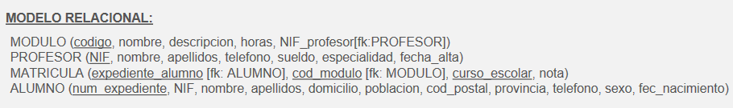
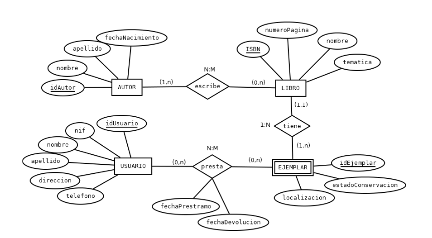
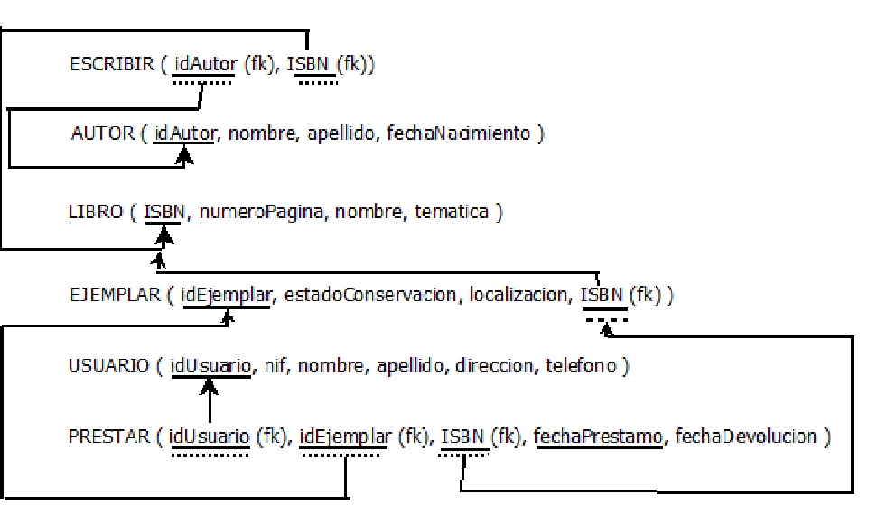

# Unidad 03 

## **Ejercicio 04**

Partiendo de dichas tablas, realizar los siguientes apartados:  
**A. Escribir las sentencias de creación de la BD y de las tablas en el orden apropiado utilizando el lenguaje SQL. Se debe tener en cuenta lo siguiente:**
 *  Elegir el tipo de dato y el tamaño más adecuado para cada campo teniendo en cuenta los valores que éstos pueden almacenar.  
 * Recordar nombrar adecuadamente las tablas, atributos y restricciones teniendo en cuenta las reglas que se  explican en los contenidos de la unidad.  
*  Incluir en las sentencias de creación de tablas las siguientes restricciones:  
	* El campo código de la tabla MODULO identifica de forma única cada registro de la tabla y está formado por una cadena de caracteres alfanuméricos de longitud fija.
	* El campo NIF de la tabla PROFESOR identifica de forma única cada registro de la tabla y está formado por una cadena de caracteres alfanuméricos de longitud fija.
	* El campo num_expediente de la tabla ALUMNO identifica de forma única cada registro de la tabla y está formado por una cadena de caracteres alfanuméricos de longitud fija.
	* Los campos expediente_alumno, cod_modulo y curso_escolar de la tabla MATRICULA identifican de forma conjunta cada registro de la tabla y provienen de las entidades ALUMNO y MODULO que participan en la relación respectivamente.
	* El campo NIF_profesor de la tabla MODULO referencia a la tabla PROFESOR.
	* Se debe cumplir la regla de integridad referencial en todas las relaciones.  
	* El sueldo de los profesores podrá estar comprendido entre 1500€ y 2000€.
	* El campo horas de la tabla MODULO no puede ser mayor de 300 horas.
	* La fecha de nacimiento de los alumnos no puede contener valores nulos.
	* El campo NIF de la tabla ALUMNO no puede repetirse.

**B. Después de crear las tablas, se van a realizar algunas modificaciones sobre ellas. Escribir las sentencias SQL apropiadas para cada uno de los subapartados siguientes:**

**a**. Eliminar la restricción que establece el valor del campo sueldo entre 1500€ y 2000€.  
**b**. Eliminar el campo descripción de la tabla MODULO.  
**c**. Añadir un campo en la tabla PROFESOR llamado cargo.  
**d.** Modificar la tabla MATRICULA para que el campo nota sólo pueda tomar valores comprendidos entre 0 y 10.  
**e**. Crear un índice para el campo nombre de la tabla ALUMNO.  
**f**. Renombrar la tabla MODULO por ASIGNATURA.  
**g**. Modificar el nombre del campo sueldo por el de salario en la tabla PROFESOR.  
**h**. Desactivar temporalmente la restricción establecida en el campo horas de la tabla MODULO. ¿Se puede?  
**i**. El dominio del campo sexo sólo puede tomar los valores "H" (de Hombre) o "M" (de Mujer).

## **Ejemplo Adicional**

## **Ejemplo Examen**

1. Después de realizar el proceso de análisis y diseño de la **BD** para un banco, el modelo relacional resultante es el siguiente:

Escribe las sentencias de creación de la BD y de las tablas en el orden apropiado utilizando el lenguaje SQL (1 punto la creación de la BD y la estructura básica de las tablas + 1 punto la definición correcta de las claves primarias y foráneas). Debes tener en cuenta lo siguiente:  

* En cuanto a los tipos de datos a utilizar (0,8 puntos si se utilizan los tipos de datos adecuados):
	* El importe de las transacciones puede ser positivo o negativo.
	* El número de sucursales del banco no pasa de 9999.
	* El número de cuentas por sucursal nunca puede ser superior a 999999.
	* Los importes en las transacciones se anotan con dos decimales y no pueden superar nunca la cantidad de 9999999999.99€ en el caso de ingresos o -9999999999.99€ en el caso de pagos.
	* Los nombres de los clientes no pasan de 50 caracteres.
	* El sexo de los clientes puede ser: “H” (hombre) o “M” (mujer).
- En cuanto a restricciones a tener en cuenta (0,2 puntos si se definen las restricciones adecuadamente):
	- La fecha de la transacción por defecto debe tomar la fecha actual.
	- El DNI de los clientes no debe repetirse.
	- El nombre del cliente no se debe repetir

2. Después de crear las tablas, vamos a realizar algunas modificaciones sobre ellas. Escribe las sentencias SQL apropiadas para cada uno de los apartados siguientes:  
**a**. Añade el campo código_postal a la tabla CLIENTE.  
**b**. Elimina el campo localidad de la tabla CLIENTE.  
**c**. Modifica el nombre del campo importe de la tabla TRANSACCIÓN por cantidad.  
**d**. Añade un índice a la tabla CLIENTE para el campo nombre.  
**e**. Añadir la opción “SI” (sin identificar) al campo sexo de la tabla CLIENTE.  
**f**.  Añade el campo teléfono a la tabla CLIENTE y haz que no pueda tener valores nulos.  
g.Modificar la clave foránea fk:CLIENTE en CLIENTE_CUENTA para que en el caso de actualizar (UPDATE) el idCliente en la tabla CLIENTE se actualice automáticamente.  
h. Desactiva temporalmente la restricción establecida en el campo teléfono de la tabla CLIENTE sin que afecte al resto de restricciones de la BD. ¿se puede? ¿qué harías entonces y qué sentencias utilizarías?

3. Escribe las sentencias SQL apropiadas para cada uno de los apartados siguientes:  
**a**. Crea los roles: dirección y caja.  
**b**.  Asigna al rol caja los siguientes permisos:
* Los permisos de consulta (SELECT) y modificación (INSERT, UPDATE y DELETE) sobre la tabla TRANSACCIÓN.
* El permiso de consulta (SELECT) sobre las tablas SUCURSAL, CUENTA, CLIENTE_CUENTA y CLIENTE.
**c**.Asigna al rol dirección los permisos de consulta (SELECT) y modificación (INSERT,  
UPDATE y DELETE) sobre todas las tablas.  
**d**.  Crea dos usuarios pepe y juan, cuya clave sea el mismo nombre de usuario. Asigna a pepe el rol dirección y a juan el rol caja. Establece el rol por defecto para cada uno de ellos.  
**e**. Elimina los roles dirección y caja. ¿qué pasa con los usuarios pepe y juan?

